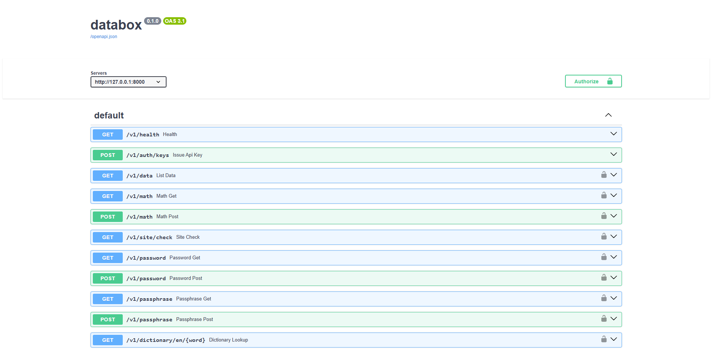

# Databox

Databox gathers data from offline or online sources and exposes a unified REST and GraphQL API using FastAPI.

## Quick start

1. Install dependencies:

   `pip install -r requirements.txt`

2. Run the API:

   `uvicorn app.main:app --reload` 

## Docker

Build the image:

`docker build -t databox .`

Run the container:

`docker run --rm -p 8000:8000 databox`

Or with Docker Compose:

`docker compose up --build`

## Endpoints

- REST:
  - GET /v1/health
  - POST /v1/auth/keys
  - GET /v1/data
  - GET /v1/ip/lookup
  - GET /v1/ip/visitor
  - GET /v1/math
  - POST /v1/math
  - GET /v1/site/check
  - GET /v1/password
  - POST /v1/password
  - GET /v1/passphrase
  - POST /v1/passphrase
  - GET /v1/dictionary/en/{word}
  - POST /v1/shamir/secret/split
  - POST /v1/shamir/secret/combine
  - GET /v1/time/now
  - GET /v1/time/utc
  - GET /v1/time/epoch
  - GET /v1/time/convert
  - GET /v1/time/diff
  - GET /v1/time/world
  - GET /v1/time/format
  - GET /v1/time/ntp/status
  - GET /v1/time/leap
  - GET /v1/timezones
  - GET /v1/timezones/abbreviations
  - GET /v1/timezones/offsets
  - GET /v1/timezones/zones
  - GET /v1/timezones/{zone_name}/current
  - GET /v1/timezones/{zone_name}
- GraphQL:
  - POST /v1/graphql

## Authentication

All routes require an API key except `GET /v1/health` and `POST /v1/auth/keys`.
Send the key in the Authorization header:

`Authorization: Bearer db_...`

## Rate limiting and request IDs

- Rate limit: 60 requests/minute per API key (or per client IP when no key is provided).
- If the limit is exceeded, the API returns 429 with `Retry-After`.
- Each response includes `X-Request-Id`. If the client does not send one, the server generates `db_<uuid>`.

## Swagger and OpenAPI

- Swagger UI: `/docs`
- ReDoc: `/redoc`
- OpenAPI JSON: `/openapi.json`

## Configuration

Set these environment variables if needed:

- DATABOX_ENV (default: dev)
- DATABOX_CORS_ORIGINS (default: *)
- DATABOX_LOCAL_DATA_PATH (default: data/sample.json)
- DATABOX_API_KEYS_PATH (default: data/api_keys.json)
- DATABOX_API_KEY_RETENTION_DAYS (default: 90)
- DATABOX_RATE_LIMIT_PER_MINUTE (default: 60)
- DATABOX_LOG_LEVEL (default: INFO)
- DATABOX_NTP_SERVERS (default: time.hixbe.com,time.google.com,time.cloudflare.com)
- DATABOX_NTP_TIMEOUT_SECONDS (default: 2)
- DATABOX_IPINFO_TOKEN (required for IP endpoints)
- DATABOX_IPINFO_LOOKUP_BASE_URL (default: https://ipinfo.io)
- DATABOX_IPINFO_VISITOR_URL (default: https://api.ipinfo.io/lite/me)
- DATABOX_IPINFO_TIMEOUT_SECONDS (default: 5)
- DATABOX_MATH_EVAL_TIMEOUT_SECONDS (default: 10)
- DATABOX_MATH_MAX_EXPR_LENGTH (default: 4096)
- DATABOX_SITE_CHECK_TIMEOUT_CONNECT_SECONDS (default: 3)
- DATABOX_SITE_CHECK_TIMEOUT_READ_SECONDS (default: 5)
- DATABOX_SITE_CHECK_MAX_REDIRECTS (default: 5)
- DATABOX_SITE_CHECK_USER_AGENT (default: databox/1.0 (+https://github.com/anisafifi/databox))
- DATABOX_SITE_CHECK_ALLOWLIST (optional CSV allowlist)
- DATABOX_SITE_CHECK_HEADER_ALLOWLIST (default: content-type,content-length,server,cache-control,location,date)
- DATABOX_PASSWORD_MAX_LENGTH (default: 128)
- DATABOX_DICTIONARY_BASE_URL (default: https://api.dictionaryapi.dev/api/v2/entries)
- DATABOX_DICTIONARY_TIMEOUT_SECONDS (default: 5)
- DATABOX_SERVER_URL (optional OpenAPI server URL)
- DATABOX_HTTP_SOURCE_URL (optional)

## Password presets

Available presets: `strong`, `pin`, `passphrase`.
When `preset` is set, you can still override any option explicitly.

## GraphQL coverage

GraphQL mirrors the REST surface. Key fields include:

- Queries: `health`, `data`, `timeNow`, `timeUtc`, `timeEpoch`, `timeConvert`, `timeDiff`, `timeWorld`, `timeFormat`, `timeNtpStatus`, `timeLeap`, `timezones`, `timezone`, `timezoneCurrent`, `timezoneAbbreviations`, `timezoneOffsets`, `timezoneZones`, `ipLookup`, `ipVisitor`, `math`, `siteCheck`, `password`, `passphrase`, `dictionaryEn`, `shamirSecretSplit`, `shamirSecretCombine`
- Mutations: `issueApiKey`

## External services

This project integrates with third-party services:

- IP info: ipinfo.io (lookup and visitor endpoints)
- Dictionary: dictionaryapi.dev (English entries)
- NTP: time.hixbe.com, time.google.com, time.cloudflare.com

## Contributors

See Git history for contributors. Contributions are welcome.
